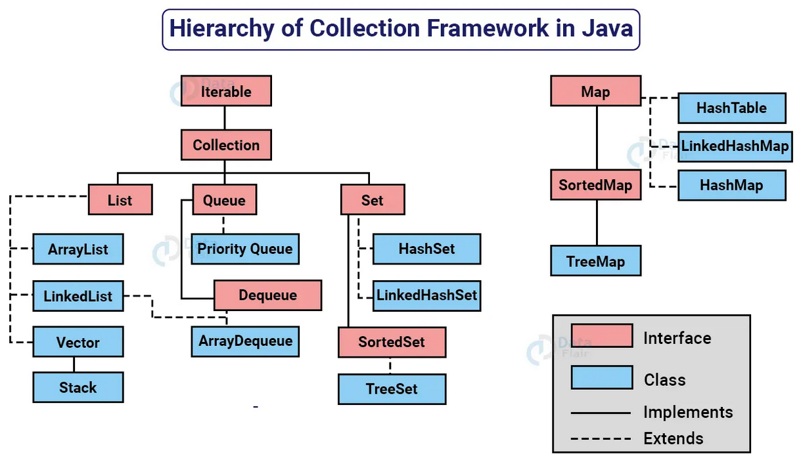

# NOTAS DO CÓDIGO
 <p>Este arquivo contém notas relativas ao bootcamp Java Cloud Native.</p>
```java
public class MinhaClass {
    public static void main(String[] args) {
        // Declaração e inicialização das variáveis
        String primeiroNome = "José";
        String segundoNome = "Silva";

        // Chamada do método nomeCompleto e armazenamento do resultado
        String nomeCompleto = nomeCompleto(primeiroNome, segundoNome);

        // Impressão do nome completo no console
        System.out.println(nomeCompleto);
    }

    // Método que concatena o primeiro e segundo nome
    public static String nomeCompleto(String primeiroNome, String segundoNome) {
        return "Resultado do método " + primeiroNome.concat(" ").concat(segundoNome);
    }
}
``

## Tipos e Variáveis em Java

Em Java, as variáveis são usadas para armazenar dados que podem ser manipulados durante a execução de um programa. Cada variável tem um tipo específico que define o tamanho e o layout da memória, o intervalo de valores que pode armazenar e as operações que podem ser realizadas sobre ela.

### Tipos Primitivos

Java possui oito tipos primitivos:

| Tipo     | Tamanho (bits) | Intervalo / Descrição                        |
|----------|----------------|----------------------------------------------|
| `byte`   | 8              | -128 a 127                                   |
| `short`  | 16             | -32.768 a 32.767                             |
| `int`    | 32             | -2^31 a 2^31-1                               |
| `long`   | 64             | -2^63 a 2^63-1                               |
| `float`  | 32             | Ponto flutuante de precisão simples          |
| `double` | 64             | Ponto flutuante de precisão dupla            |
| `char`   | 16             | Representa um caractere Unicode              |
| `boolean`| 1              | Representa valores `true` ou `false`         |

### Variáveis de Referência

Além dos tipos primitivos, Java também possui variáveis de referência, que são usadas para referenciar objetos. Exemplos incluem:

- `String`: para cadeias de caracteres.
- `Arrays`: para coleções de elementos do mesmo tipo.
- Classes e interfaces definidas pelo usuário.

### Declaração de Variáveis

Para declarar uma variável, você deve especificar o tipo seguido pelo nome da variável. Por exemplo:

```java
int idade;
String nome;
```

### Inicialização de Variáveis

Você pode inicializar uma variável no momento da declaração:

```java
int idade = 25;
String nome = "Ana";
```

### Regras de Nomenclatura

- Os nomes de variáveis devem começar com uma letra, `$` ou `_`.
- Não podem começar com um dígito.
- São sensíveis a maiúsculas e minúsculas (`idade` e `Idade` são diferentes).

### Constantes

Constantes são variáveis cujo valor não pode ser alterado após a inicialização. Em Java, usamos a palavra-chave `final` para declarar uma constante. Por exemplo:

```java
final int NUMERO_MAXIMO = 100;
final String SAUDACAO = "Olá, Mundo!";
```

### A Classe String

A classe `String` é usada para representar cadeias de caracteres. Strings são imutáveis, o que significa que uma vez criadas, não podem ser alteradas. Métodos comuns da classe `String` incluem:

- `length()`: retorna o comprimento da string.
- `charAt(int index)`: retorna o caractere na posição especificada.
- `substring(int beginIndex, int endIndex)`: retorna uma substring.
- `toUpperCase()`: converte todos os caracteres para maiúsculas.
- `toLowerCase()`: converte todos os caracteres para minúsculas.

Exemplo de uso da classe `String`:

```java
String saudacao = "Olá, Mundo!";
int comprimento = saudacao.length();
char primeiraLetra = saudacao.charAt(0);
String parte = saudacao.substring(0, 3);
String maiuscula = saudacao.toUpperCase();
```

## Modo Debug

O modo debug é uma ferramenta essencial para desenvolvedores, pois permite a execução passo a passo do código, facilitando a identificação e correção de erros. No modo debug, você pode:

- **Definir Breakpoints**: Pontos no código onde a execução será pausada.
- **Inspecionar Variáveis**: Verificar o valor das variáveis em diferentes pontos da execução.
- **Executar Passo a Passo**: Avançar a execução linha por linha ou entrar em métodos específicos.
- **Avaliar Expressões**: Avaliar expressões e ver seus resultados em tempo real.

### Como Usar o Modo Debug no VS Code

1. **Definir Breakpoints**: Clique na margem esquerda ao lado do número da linha onde deseja pausar a execução.
2. **Iniciar Debug**: Clique no ícone de "Run and Debug" na barra lateral ou pressione `F5`.
3. **Controlar a Execução**:
    - **Continue (`F5`)**: Continua a execução até o próximo breakpoint.
    - **Step Over (`F10`)**: Executa a próxima linha de código, sem entrar em métodos.
    - **Step Into (`F11`)**: Entra no método chamado na linha atual.
    - **Step Out (`Shift+F11`)**: Sai do método atual e retorna para o chamador.

### Exemplo de Uso

```java
public class DebugExemplo {
     public static void main(String[] args) {
          int a = 5;
          int b = 10;
          int resultado = soma(a, b);
          System.out.println("Resultado: " + resultado);
     }

     public static int soma(int x, int y) {
          return x + y;
     }
}
```

Defina um breakpoint na linha `int resultado = soma(a, b);` e inicie o modo debug para ver como o valor de `a` e `b` são passados para o método `soma` e como o resultado é calculado.

## Operadores Aritméticos

Os operadores aritméticos são utilizados para realizar operações matemáticas entre variáveis e/ou valores. Abaixo estão os operadores aritméticos mais comuns em muitas linguagens de programação:

- **Adição (+)**: Soma dois valores.
- **Subtração (-)**: Subtrai o segundo valor do primeiro.
- **Multiplicação (*)**: Multiplica dois valores.
- **Divisão (/)**: Divide o primeiro valor pelo segundo.
- **Módulo (%)**: Retorna o resto da divisão do primeiro valor pelo segundo.
- **Incremento (++)**: Aumenta o valor de uma variável em 1.
- **Decremento (--)**: Diminui o valor de uma variável em 1.

### Exemplos

- `5 + 3` resulta em `8`
- `10 - 2` resulta em `8`
- `4 * 2` resulta em `8`
- `16 / 2` resulta em `8`
- `17 % 3` resulta em `2`
- Se `x = 5`, então `x++` resulta em `6`
- Se `y = 5`, então `y--` resulta em `4`

## Operadores Unários

Os operadores unários são utilizados com apenas um operando para realizar várias operações, como incrementar/decrementar um valor, inverter um valor booleano, ou mudar o sinal de um número. Em Java, os operadores unários incluem:

- **Incremento (`++`)**: Aumenta o valor de uma variável em 1.
- **Decremento (`--`)**: Diminui o valor de uma variável em 1.
- **Mais (`+`)**: Indica um valor positivo (geralmente implícito).
- **Menos (`-`)**: Inverte o sinal de um valor numérico.
- **Negação lógica (`!`)**: Inverte o valor de uma expressão booleana.

### Exemplos

- `int x = 5;`
    - `x++` resulta em `6`
    - `x--` resulta em `4`
    - `-x` resulta em `-5`
- `boolean flag = true;`
    - `!flag` resulta em `false`

Os operadores de incremento e decremento podem ser usados em duas formas:
- **Prefixo**: `++x` ou `--x` (incrementa/decrementa antes de usar o valor na expressão).
- **Postfixo**: `x++` ou `x--` (incrementa/decrementa depois de usar o valor na expressão).

### Exemplo de Uso

```java
int a = 10;
int b = ++a; // b é 11, a é incrementado antes de ser atribuído a b
int c = a--; // c é 11, a é decrementado após ser atribuído a c
boolean d = !false; // d é true
```

## Operador Ternário

O operador ternário é uma forma concisa de expressar uma condição que retorna um valor entre duas opções. Ele é composto por três partes: uma expressão booleana, um valor a ser retornado se a expressão for verdadeira, e um valor a ser retornado se a expressão for falsa. A sintaxe do operador ternário é:

```java
condição ? valorSeVerdadeiro : valorSeFalso;
```

### Exemplo de Uso

```java
int idade = 18;
String mensagem = (idade >= 18) ? "Maior de idade" : "Menor de idade";
System.out.println(mensagem); // Imprime "Maior de idade"
```

No exemplo acima, a expressão `idade >= 18` é avaliada. Se for verdadeira, a variável `mensagem` recebe o valor `"Maior de idade"`, caso contrário, recebe o valor `"Menor de idade"`. O operador ternário é útil para simplificar expressões condicionais que de outra forma exigiriam uma estrutura `if-else`.

## Operadores Relacionais

Os operadores relacionais são usados para comparar dois valores. Eles retornam um valor booleano (`true` ou `false`) com base na comparação. Em Java, os operadores relacionais incluem:

- **Igual a (`==`)**: Verifica se dois valores são iguais.
- **Diferente de (`!=`)**: Verifica se dois valores são diferentes.
- **Maior que (`>`)**: Verifica se o valor à esquerda é maior que o valor à direita.
- **Menor que (`<`)**: Verifica se o valor à esquerda é menor que o valor à direita.
- **Maior ou igual a (`>=`)**: Verifica se o valor à esquerda é maior ou igual ao valor à direita.
- **Menor ou igual a (`<=`)**: Verifica se o valor à esquerda é menor ou igual ao valor à direita.

### Exemplos

- `5 == 5` resulta em `true`
- `5 != 3` resulta em `true`
- `7 > 3` resulta em `true`
- `2 < 4` resulta em `true`
- `5 >= 5` resulta em `true`
- `3 <= 6` resulta em `true`

Os operadores relacionais são frequentemente usados em estruturas de controle de fluxo, como `if`, `for`, e `while`, para tomar decisões com base nas comparações.

### Exemplo de Uso

```java
int a = 10;
int b = 20;

if (a < b) {
    System.out.println("a é menor que b");
} else {
    System.out.println("a não é menor que b");
}
```

## Uso do Método `.equals()`

Em Java, o método `.equals()` é usado para comparar a igualdade de dois objetos. Diferente do operador `==`, que compara referências de memória, o método `.equals()` compara o conteúdo dos objetos.

### Exemplo de Uso

```java
String nome1 = "Ana";
String nome2 = "Ana";

if (nome1.equals(nome2)) {
    System.out.println("Os nomes são iguais.");
} else {
    System.out.println("Os nomes são diferentes.");
}
```

No exemplo acima, `nome1.equals(nome2)` retorna `true` porque o conteúdo das duas strings é igual. Se usássemos `nome1 == nome2`, o resultado poderia ser `false` se as referências de memória fossem diferentes, mesmo que o conteúdo fosse o mesmo.

### Implementação do `.equals()`

Ao criar suas próprias classes, você pode sobrescrever o método `.equals()` para definir como dois objetos dessa classe devem ser comparados.

```java
public class Pessoa {
    private String nome;
    private int idade;

    public Pessoa(String nome, int idade) {
        this.nome = nome;
        this.idade = idade;
    }

    @Override
    public boolean equals(Object obj) {
        if (this == obj) return true;
        if (obj == null || getClass() != obj.getClass()) return false;
        Pessoa pessoa = (Pessoa) obj;
        return idade == pessoa.idade && nome.equals(pessoa.nome);
    }
}
```

No exemplo acima, a classe `Pessoa` sobrescreve o método `.equals()` para comparar o nome e a idade dos objetos `Pessoa`.

### Importância do `.equals()`

Usar o método `.equals()` corretamente é crucial para garantir que a comparação de objetos em coleções, como `List` e `Set`, funcione como esperado. Sem uma implementação adequada, a lógica de comparação pode falhar, levando a resultados inesperados.

## Operadores Lógicos

Os operadores lógicos são usados para combinar expressões booleanas e retornar um valor booleano (`true` ou `false`). Em Java, os operadores lógicos incluem:

- **E lógico (`&&`)**: Retorna `true` se ambas as expressões forem verdadeiras.
- **OU lógico (`||`)**: Retorna `true` se pelo menos uma das expressões for verdadeira.
- **NEGAÇÃO lógica (`!`)**: Inverte o valor de uma expressão booleana.

### Exemplos

- `true && true` resulta em `true`
- `true && false` resulta em `false`
- `true || false` resulta em `true`
- `false || false` resulta em `false`
- `!true` resulta em `false`
- `!false` resulta em `true`

Os operadores lógicos são frequentemente usados em estruturas de controle de fluxo, como `if`, `for`, e `while`, para tomar decisões com base em múltiplas condições.

### Exemplo de Uso

```java
int a = 10;
int b = 20;
boolean resultado = (a < b) && (b > 15);

if (resultado) {
    System.out.println("Ambas as condições são verdadeiras.");
} else {
    System.out.println("Uma ou ambas as condições são falsas.");
}
```

No exemplo acima, a variável `resultado` será `true` porque ambas as condições `(a < b)` e `(b > 15)` são verdadeiras.

## Tipos de Operadores em Java

| Tipo de Operador       | Descrição                                                                 |
|------------------------|---------------------------------------------------------------------------|
| **Aritméticos**        | Realizam operações matemáticas básicas como adição, subtração, etc.       |
| **Unários**            | Operam em um único operando, como incremento, decremento e negação lógica.|
| **Ternário**           | Utilizado para expressões condicionais que retornam um valor entre duas opções. |
| **Relacionais**        | Comparam dois valores e retornam um booleano (`true` ou `false`).         |
| **Lógicos**            | Combinam expressões booleanas e retornam um valor booleano.               |
| **Atribuição**         | Atribuem valores a variáveis.                                             |
| **Bitwise**            | Realizam operações em nível de bit.                                       |
| **Shift**              | Deslocam bits para a esquerda ou direita.                                 |
| **Instanceof**         | Verifica se um objeto é uma instância de uma classe específica.           |

## Métodos em Java
Os métodos em Java são blocos de código que realizam uma tarefa específica e podem ser chamados para executar essa tarefa. Eles ajudam a organizar e reutilizar o código, tornando-o mais modular e legível.

### Estrutura de um Método

Um método em Java é composto por:

1. **Modificadores de Acesso**: Definem a visibilidade do método (`public`, `private`, `protected`).
2. **Tipo de Retorno**: O tipo de dado que o método retorna (`void` se não retornar nada).
3. **Nome do Método**: Deve ser um identificador válido.
4. **Parâmetros**: Lista de parâmetros que o método aceita, entre parênteses.
5. **Corpo do Método**: O bloco de código que define o que o método faz, entre chaves `{}`.

### Exemplo de Método

```java
public class Calculadora {
    /**
     * Este método calcula a soma de dois números inteiros.
     *
     * @param a o primeiro número inteiro
     * @param b o segundo número inteiro
     * @return a soma dos dois números inteiros
     * @throws IllegalArgumentException se qualquer um dos parâmetros for nulo
     */
    public int soma(int a, int b) {
        if (a == null || b == null) {
            throw new IllegalArgumentException("Os parâmetros não podem ser nulos");
        }
        return a + b;
    }
}
```

### Chamando um Método

Para chamar um método, você usa o nome do método seguido de parênteses, passando os argumentos necessários:

```java
public class Main {
    public static void main(String[] args) {
        Calculadora calc = new Calculadora();
        int resultado = calc.soma(5, 3);
        System.out.println("Resultado: " + resultado);
    }
}
```

### Tipos de Métodos

- **Métodos de Instância**: Pertencem a uma instância da classe e podem acessar variáveis de instância.
- **Métodos Estáticos**: Pertencem à classe e não podem acessar variáveis de instância diretamente.

### Sobrecarga de Métodos

A sobrecarga de métodos permite definir vários métodos com o mesmo nome, mas com diferentes listas de parâmetros:

```java
public class Calculadora {
    public int soma(int a, int b) {
        return a + b;
    }

    public double soma(double a, double b) {
        return a + b;
    }
}
```

### Documentação de Métodos

Usar comentários Javadoc para documentar métodos é uma prática recomendada. Eles descrevem o propósito do método, seus parâmetros, valor de retorno e exceções lançadas.

```java
/**
 * Este método calcula a soma de dois números inteiros.
 *
 * @param a o primeiro número inteiro
 * @param b o segundo número inteiro
 * @return a soma dos dois números inteiros
 * @throws IllegalArgumentException se qualquer um dos parâmetros for nulo
 */
public int soma(int a, int b) {
    if (a == null || b == null) {
        throw new IllegalArgumentException("Os parâmetros não podem ser nulos");
    }
    return a + b;
}
```

### Visibilidade dos Métodos

Os modificadores de acesso controlam a visibilidade dos métodos:

- **public**: O método pode ser acessado de qualquer lugar.
- **private**: O método só pode ser acessado dentro da própria classe.
- **protected**: O método pode ser acessado dentro da própria classe, por subclasses e por classes do mesmo pacote.
- **default** (sem modificador): O método pode ser acessado por classes do mesmo pacote.

### Exceções

Exceções são eventos que ocorrem durante a execução de um programa e interrompem o fluxo normal de instruções. Em Java, você pode usar exceções para tratar erros e outras condições excepcionais.

#### Lançando Exceções

Você pode lançar uma exceção usando a palavra-chave `throw`:

```java
public void verificaIdade(int idade) {
    if (idade < 18) {
        throw new IllegalArgumentException("Idade deve ser maior ou igual a 18");
    }
}
```

#### Tratando Exceções

Você pode tratar exceções usando blocos `try-catch`:

```java
public void exemploTratamento() {
    try {
        int resultado = 10 / 0;
    } catch (ArithmeticException e) {
        System.out.println("Erro: Divisão por zero");
    }
}
```

#### Declaração de Exceções

Métodos podem declarar que lançam exceções usando a cláusula `throws`:

```java
public void metodoQueLancaExcecao() throws IOException {
    // código que pode lançar IOException
}
```

### Boas Práticas

- **Nomes Significativos**: Use nomes de métodos que descrevam claramente o que eles fazem.
- **Coesão**: Cada método deve realizar uma única tarefa ou um grupo de tarefas relacionadas.
- **Documentação**: Documente seus métodos usando Javadoc para facilitar a manutenção e o entendimento do código.
- **Tratamento de Exceções**: Sempre trate exceções de maneira adequada para evitar que o programa falhe inesperadamente.


Os métodos em Java são blocos de código que realizam uma tarefa específica e podem ser chamados para executar essa tarefa. Eles ajudam a organizar e reutilizar o código, tornando-o mais modular e legível.

### Estrutura de um Método

Um método em Java é composto por:

1. **Modificadores de Acesso**: Definem a visibilidade do método (`public`, `private`, `protected`).
2. **Tipo de Retorno**: O tipo de dado que o método retorna (`void` se não retornar nada).
3. **Nome do Método**: Deve ser um identificador válido.
4. **Parâmetros**: Lista de parâmetros que o método aceita, entre parênteses.
5. **Corpo do Método**: O bloco de código que define o que o método faz, entre chaves `{}`.

### Exemplo de Método

```java
public class Calculadora {
    /**
     * Este método calcula a soma de dois números inteiros.
     *
     * @param a o primeiro número inteiro
     * @param b o segundo número inteiro
     * @return a soma dos dois números inteiros
     * @throws IllegalArgumentException se qualquer um dos parâmetros for nulo
     */
    public int soma(int a, int b) {
        if (a == null || b == null) {
            throw new IllegalArgumentException("Os parâmetros não podem ser nulos");
        }
        return a + b;
    }
}
```

### Chamando um Método

Para chamar um método, você usa o nome do método seguido de parênteses, passando os argumentos necessários:

```java
public class Main {
    public static void main(String[] args) {
        Calculadora calc = new Calculadora();
        int resultado = calc.soma(5, 3);
        System.out.println("Resultado: " + resultado);
    }
}
```

### Tipos de Métodos

- **Métodos de Instância**: Pertencem a uma instância da classe e podem acessar variáveis de instância.
- **Métodos Estáticos**: Pertencem à classe e não podem acessar variáveis de instância diretamente.

### Sobrecarga de Métodos

A sobrecarga de métodos permite definir vários métodos com o mesmo nome, mas com diferentes listas de parâmetros:

```java
public class Calculadora {
    public int soma(int a, int b) {
        return a + b;
    }

    public double soma(double a, double b) {
        return a + b;
    }
}
```

### Documentação de Métodos

Usar comentários Javadoc para documentar métodos é uma prática recomendada. Eles descrevem o propósito do método, seus parâmetros, valor de retorno e exceções lançadas.

```java
/**
 * Este método calcula a soma de dois números inteiros.
 *
 * @param a o primeiro número inteiro
 * @param b o segundo número inteiro
 * @return a soma dos dois números inteiros
 * @throws IllegalArgumentException se qualquer um dos parâmetros for nulo
 */
public int soma(int a, int b) {
    if (a == null || b == null) {
        throw new IllegalArgumentException("Os parâmetros não podem ser nulos");
    }
    return a + b;
}
```

### Boas Práticas

- **Nomes Significativos**: Use nomes de métodos que descrevam claramente o que eles fazem.
- **Coesão**: Cada método deve realizar uma única tarefa ou um grupo de tarefas relacionadas.
- **Documentação**: Documente seus métodos usando Javadoc para facilitar a manutenção e o entendimento do código.
### Gerando Documentação com Javadoc

Para gerar a documentação de um arquivo Java usando o Javadoc no terminal, siga os passos abaixo:

1. **Abra o Terminal**: Navegue até o diretório onde seu arquivo Java está localizado.

2. **Comando Javadoc**: Use o comando `javadoc` seguido do nome do arquivo Java. Por exemplo, para gerar a documentação do arquivo `MinhaClass.java`, você pode usar o seguinte comando:

    ```sh
    javadoc MinhaClass.java
    ```

3. **Especificar Diretório de Saída**: Você pode especificar um diretório de saída para os arquivos HTML gerados usando a opção `-d`. Por exemplo:

    ```sh
    javadoc -d docs MinhaClass.java
    ```

    Isso criará uma pasta chamada `docs` contendo a documentação gerada.

4. **Gerar Documentação para um Pacote**: Para gerar a documentação de todos os arquivos em um pacote, você pode usar o comando:

    ```sh
    javadoc -d docs pacote/*.java
    ```

5. **Incluir Comentários Javadoc**: Certifique-se de que seus arquivos Java contenham comentários Javadoc adequados para que a documentação gerada seja útil e informativa.

### Exemplo Completo

Suponha que você tenha um arquivo `Calculadora.java` e deseja gerar a documentação:

```sh
javadoc -d docs Calculadora.java
```

Após executar o comando, a documentação será gerada na pasta `docs`, e você poderá abrir os arquivos HTML no seu navegador para visualizar a documentação.

### Opções Adicionais

O Javadoc oferece várias opções adicionais para personalizar a geração da documentação. Você pode ver todas as opções disponíveis usando o comando:

```sh
javadoc -help
```

Isso exibirá uma lista de todas as opções que você pode usar com o comando `javadoc`.

### Referência

Para mais informações sobre o uso do Javadoc, consulte a [documentação oficial do Javadoc](https://docs.oracle.com/javase/8/docs/technotes/tools/windows/javadoc.html).

## Executando Arquivos Java no Terminal

Para compilar e executar arquivos Java no terminal, siga os passos abaixo:

### Compilando um Arquivo Java

1. **Abra o Terminal**: Navegue até o diretório onde seu arquivo Java está localizado.
2. **Comando `javac`**: Use o comando `javac` seguido do nome do arquivo Java para compilar o código. Por exemplo, para compilar `MinhaClass.java`, use o comando:

    ```sh
    javac MinhaClass.java
    ```

    Isso gerará um arquivo `MinhaClass.class` no mesmo diretório.

### Executando um Arquivo Java

1. **Comando `java`**: Use o comando `java` seguido do nome da classe (sem a extensão `.class`) para executar o programa. Por exemplo, para executar a classe `MinhaClass`, use o comando:

    ```sh
    java MinhaClass
    ```

    Isso iniciará a execução do programa e exibirá a saída no terminal.

### Exemplo Completo

Suponha que você tenha um arquivo `MinhaClass.java` com o seguinte conteúdo:

```java
public class MinhaClass {
    public static void main(String[] args) {
        System.out.println("Olá, Mundo!");
    }
}
```

Para compilar e executar este arquivo, siga os passos:

1. Compile o arquivo:

    ```sh
    javac MinhaClass.java
    ```

2. Execute o arquivo compilado:

    ```sh
    java MinhaClass
    ```

    A saída será:

    ```
    Olá, Mundo!
    ```

### Referência

Para mais informações sobre o uso dos comandos `javac` e `java`, consulte a [documentação oficial do Java](https://docs.oracle.com/javase/8/docs/technotes/tools/windows/javac.html).

## Principais Comandos do CMD

| Comando       | Descrição                                                                 |
|---------------|---------------------------------------------------------------------------|
| `cd`          | Altera o diretório atual.                                                 |
| `dir`         | Lista os arquivos e diretórios no diretório atual.                        |
| `copy`        | Copia arquivos de um local para outro.                                    |
| `move`        | Move arquivos de um local para outro.                                     |
| `del`         | Exclui arquivos.                                                          |
| `mkdir`       | Cria um novo diretório.                                                   |
| `rmdir`       | Remove um diretório vazio.                                                |
| `cls`         | Limpa a tela do terminal.                                                 |
| `echo`        | Exibe mensagens ou ativa/desativa a exibição de comandos.                 |
| `exit`        | Fecha a janela do CMD.                                                    |
| `ipconfig`    | Exibe informações de configuração de rede.                                |
| `ping`        | Testa a conectividade com um endereço IP específico.                      |
| `tasklist`    | Lista todos os processos em execução.                                     |
| `taskkill`    | Encerra um processo em execução.                                          |
| `chkdsk`      | Verifica e repara erros no disco.                                         |
| `sfc`         | Verifica e repara arquivos de sistema corrompidos.                        |
| `netstat`     | Exibe conexões de rede e estatísticas de protocolo.                       |
| `shutdown`    | Desliga ou reinicia o computador.                                         |
| `systeminfo`  | Exibe informações detalhadas sobre a configuração do sistema.             |
| `help`        | Fornece ajuda sobre comandos do CMD.                                      |

## Wrapper Classes em Java

As Wrapper Classes em Java são usadas para encapsular tipos primitivos em um objeto. Isso permite que os tipos primitivos sejam usados em contextos que requerem objetos, como em coleções do framework Java Collections.

### Tipos de Wrapper Classes

Java fornece uma classe wrapper para cada tipo primitivo:

| Tipo Primitivo | Classe Wrapper |
|----------------|-----------------|
| `byte`         | `Byte`          |
| `short`        | `Short`         |
| `int`          | `Integer`       |
| `long`         | `Long`          |
| `float`        | `Float`         |
| `double`       | `Double`        |
| `char`         | `Character`     |
| `boolean`      | `Boolean`       |

### Autoboxing e Unboxing

- **Autoboxing**: É o processo de conversão automática de um tipo primitivo para o tipo correspondente da classe wrapper.
- **Unboxing**: É o processo de conversão automática de um objeto da classe wrapper para o tipo primitivo correspondente.

#### Exemplo de Autoboxing

```java
int num = 10;
Integer numWrapper = num; // Autoboxing
```

#### Exemplo de Unboxing

```java
Integer numWrapper = 10;
int num = numWrapper; // Unboxing
```

### Métodos Úteis das Wrapper Classes

As classes wrapper fornecem vários métodos úteis para manipulação e conversão de valores.

#### Exemplo com a Classe `Integer`

```java
Integer num = Integer.valueOf(10); // Criação de um Integer
int valor = num.intValue(); // Conversão para int
String str = num.toString(); // Conversão para String
int parsed = Integer.parseInt("123"); // Conversão de String para int
```

### Comparação de Objetos Wrapper

Para comparar objetos das classes wrapper, use o método `.equals()` em vez do operador `==`, que compara referências de memória.

#### Exemplo de Comparação

```java
Integer num1 = 100;
Integer num2 = 100;

if (num1.equals(num2)) {
    System.out.println("Os valores são iguais.");
} else {
    System.out.println("Os valores são diferentes.");
}
```

### Uso em Coleções

As classes wrapper são frequentemente usadas em coleções, como `ArrayList`, que não suportam tipos primitivos.

#### Exemplo com `ArrayList`

```java
ArrayList<Integer> lista = new ArrayList<>();
lista.add(10); // Autoboxing
int valor = lista.get(0); // Unboxing
```

### Benefícios das Wrapper Classes

- **Compatibilidade com Coleções**: Permitem o uso de tipos primitivos em coleções.
- **Métodos Utilitários**: Fornecem métodos para conversão e manipulação de valores.
- **Imutabilidade**: Objetos das classes wrapper são imutáveis, o que significa que seu valor não pode ser alterado após a criação.

### Considerações de Desempenho

Embora as classes wrapper ofereçam muitos benefícios, elas podem introduzir sobrecarga de desempenho devido à criação de objetos. Use tipos primitivos quando o desempenho for crítico.

### Conclusão

## Wrapper Classes em Java

As Wrapper Classes em Java são usadas para encapsular tipos primitivos em um objeto. Isso permite que os tipos primitivos sejam usados em contextos que requerem objetos, como em coleções do framework Java Collections.

### Tipos de Wrapper Classes

Java fornece uma classe wrapper para cada tipo primitivo:

| Tipo Primitivo | Classe Wrapper |
|----------------|-----------------|
| `byte`         | `Byte`          |
| `short`        | `Short`         |
| `int`          | `Integer`       |
| `long`         | `Long`          |
| `float`        | `Float`         |
| `double`       | `Double`        |
| `char`         | `Character`     |
| `boolean`      | `Boolean`       |

### Autoboxing e Unboxing

- **Autoboxing**: É o processo de conversão automática de um tipo primitivo para o tipo correspondente da classe wrapper.
- **Unboxing**: É o processo de conversão automática de um objeto da classe wrapper para o tipo primitivo correspondente.

#### Exemplo de Autoboxing

```java
int num = 10;
Integer numWrapper = num; // Autoboxing
```

#### Exemplo de Unboxing

```java
Integer numWrapper = 10;
int num = numWrapper; // Unboxing
```

### Métodos Úteis das Wrapper Classes

As classes wrapper fornecem vários métodos úteis para manipulação e conversão de valores.

#### Exemplo com a Classe `Integer`

```java
Integer num = Integer.valueOf(10); // Criação de um Integer
int valor = num.intValue(); // Conversão para int
String str = num.toString(); // Conversão para String
int parsed = Integer.parseInt("123"); // Conversão de String para int
```

### Comparação de Objetos Wrapper

Para comparar objetos das classes wrapper, use o método `.equals()` em vez do operador `==`, que compara referências de memória.

#### Exemplo de Comparação

```java
Integer num1 = 100;
Integer num2 = 100;

if (num1.equals(num2)) {
    System.out.println("Os valores são iguais.");
} else {
    System.out.println("Os valores são diferentes.");
}
```

### Uso em Coleções

As classes wrapper são frequentemente usadas em coleções, como `ArrayList`, que não suportam tipos primitivos.

#### Exemplo com `ArrayList`

```java
ArrayList<Integer> lista = new ArrayList<>();
lista.add(10); // Autoboxing
int valor = lista.get(0); // Unboxing
```

### Benefícios das Wrapper Classes

- **Compatibilidade com Coleções**: Permitem o uso de tipos primitivos em coleções.
- **Métodos Utilitários**: Fornecem métodos para conversão e manipulação de valores.
- **Imutabilidade**: Objetos das classes wrapper são imutáveis, o que significa que seu valor não pode ser alterado após a criação.

### Considerações de Desempenho

Embora as classes wrapper ofereçam muitos benefícios, elas podem introduzir sobrecarga de desempenho devido à criação de objetos. Use tipos primitivos quando o desempenho for crítico.

### Conclusão

As wrapper classes são uma parte essencial da linguagem Java, permitindo que tipos primitivos sejam tratados como objetos. Elas facilitam a manipulação de dados e a integração com APIs que requerem objetos, ao mesmo tempo em que fornecem métodos utilitários para conversão e manipulação de valores.

## Controle de Fluxo em Java

O controle de fluxo em Java permite que você controle a execução do programa com base em condições e repetições. Ele é dividido em três categorias principais: **estruturas condicionais**, **estruturas de repetição** e **estruturas de interrupção**.

### Estruturas Condicionais

As estruturas condicionais permitem executar diferentes blocos de código com base em condições.

#### `if-else`

A estrutura `if-else` é usada para executar um bloco de código se uma condição for verdadeira e outro bloco se for falsa.

```java
int idade = 18;

if (idade >= 18) {
    System.out.println("Maior de idade");
} else {
    System.out.println("Menor de idade");
}
```

#### `else if`

O `else if` permite verificar múltiplas condições.

```java
int nota = 85;

if (nota >= 90) {
    System.out.println("Aprovado com excelência");
} else if (nota >= 70) {
    System.out.println("Aprovado");
} else {
    System.out.println("Reprovado");
}
```

#### `switch`

O `switch` é usado para selecionar um bloco de código a ser executado com base no valor de uma variável.

```java
int dia = 3;

switch (dia) {
    case 1:
        System.out.println("Domingo");
        break;
    case 2:
        System.out.println("Segunda-feira");
        break;
    case 3:
        System.out.println("Terça-feira");
        break;
    default:
        System.out.println("Dia inválido");
}
```

### Estruturas de Repetição

As estruturas de repetição permitem executar um bloco de código várias vezes.

#### `for`

O `for` é usado quando o número de iterações é conhecido.

```java
for (int i = 0; i < 5; i++) {
    System.out.println("Contagem: " + i);
}
```

#### `while`

O `while` é usado quando o número de iterações não é conhecido e depende de uma condição.

```java
int contador = 0;

while (contador < 5) {
    System.out.println("Contagem: " + contador);
    contador++;
}
```

#### `do-while`

O `do-while` garante que o bloco de código seja executado pelo menos uma vez.

```java
int contador = 0;

do {
    System.out.println("Contagem: " + contador);
    contador++;
} while (contador < 5);
```

### Estruturas de Interrupção

As estruturas de interrupção permitem alterar o fluxo de execução dentro de loops ou `switch`.

#### `break`

O `break` interrompe a execução do loop ou do `switch`.

```java
for (int i = 0; i < 10; i++) {
    if (i == 5) {
        break;
    }
    System.out.println("Número: " + i);
}
```

#### `continue`

O `continue` pula para a próxima iteração do loop.

```java
for (int i = 0; i < 10; i++) {
    if (i % 2 == 0) {
        continue;
    }
    System.out.println("Número ímpar: " + i);
}
```

#### `return`

O `return` encerra a execução de um método e retorna um valor (se aplicável).

```java
public int soma(int a, int b) {
    return a + b;
}
```

### Boas Práticas

- Use `if-else` para condições simples e `switch` para múltiplos casos.
- Evite loops infinitos, a menos que sejam intencionais.
- Sempre use `break` em um `switch` para evitar a execução de casos subsequentes.
- Prefira `for` quando souber o número de iterações e `while` quando depender de uma condição.

O controle de fluxo é essencial para criar programas dinâmicos e flexíveis, permitindo que você tome decisões e repita ações com base em condições específicas.

# Exceções em Java

## O que são Exceções?

Exceções são eventos que ocorrem durante a execução de um programa que interrompem o fluxo normal das instruções. Elas podem ser causadas por erros de programação, problemas de entrada/saída, ou condições inesperadas que ocorrem durante a execução.

## Tipos de Exceções

As exceções em Java podem ser classificadas em duas categorias principais:

1. **Exceções Verificadas (Checked Exceptions)**:
   - São exceções que o compilador exige que sejam tratadas. Se um método pode lançar uma exceção verificada, ele deve declarar isso em sua assinatura usando a palavra-chave `throws`.
   - Exemplo: `IOException`, `SQLException`.

2. **Exceções Não Verificadas (Unchecked Exceptions)**:
   - São exceções que não precisam ser declaradas ou tratadas. Elas geralmente indicam erros de programação, como acessar um índice fora dos limites de um array.
   - Exemplo: `NullPointerException`, `ArrayIndexOutOfBoundsException`, `ArithmeticException`.

## Estrutura de Tratamento de Exceções

O tratamento de exceções em Java é feito usando os blocos `try`, `catch`, `finally` e `throw`.

### Bloco `try`

O bloco `try` contém o código que pode gerar uma exceção. Se uma exceção ocorrer, o fluxo de controle é transferido para o bloco `catch`.

```java
try {
    // Código que pode gerar uma exceção
} catch (TipoDaExcecao e) {
    // Código para tratar a exceção
}
```

# POO (Programação orientada a objetos)

## Modificadores de acesso

Em Java, os **modificadores de acesso** controlam a visibilidade de atributos, métodos e classes. Eles determinam quem pode acessar determinada parte do código.

* `public:` Este é o mais permissivo de todos. Quando você declara um membro (uma classe, método ou variável) como public, ele pode ser acessado de qualquer lugar do seu programa e até mesmo de outros programas que utilizam o seu código. É como uma porta completamente aberta.

* `protected`: Este modificador oferece um nível de acesso um pouco mais restrito. Membros protected podem ser acessados dentro da mesma classe, por classes no mesmo pacote e por subclasses (classes que herdam da classe original), mesmo que estejam em pacotes diferentes. Imagine uma área restrita dentro de um prédio, acessível aos funcionários e seus familiares.

* `private`: Este é o modificador mais restritivo. Membros private só podem ser acessados dentro da própria classe onde foram declarados. Nenhuma outra classe, nem mesmo subclasses ou classes no mesmo pacote, podem acessá-los diretamente. É como um cofre pessoal dentro de um apartamento.

## 🛡️ Tipos de Modificadores de Acesso

| Modificador     | Visível para...                              | Palavra-chave  | Exemplo                        |
|----------------|-----------------------------------------------|----------------|--------------------------------|
| `public`       | Todas as classes                              | `public`       | `public class MinhaClasse`     |
| `protected`    | Mesmo pacote e subclasses                     | `protected`    | `protected int idade;`         |
| *default*      | (sem modificador) Apenas no mesmo pacote      | *(nenhuma)*    | `int idade;`                   |
| `private`      | Somente dentro da mesma classe                | `private`      | `private String nome;`         |

---

## 🧩 Exemplos práticos

```java
1. Public
public class Pessoa {
    public String nome;

    public void falar() {
        System.out.println("Olá!");
    }
}
Qualquer outra classe pode acessar nome e falar().

2. Private
public class Pessoa {
    private String senha;

    private void mostrarSenha() {
        System.out.println(senha);
    }
}
Apenas a própria classe Pessoa pode acessar senha e mostrarSenha().

3. Protected
public class Pessoa {
    protected int idade;
}
Classes no mesmo pacote e subclasses (mesmo em pacotes diferentes) podem acessar idade.

4. Default
class Pessoa {
    String nome;
}
Atributo nome acessível somente por classes no mesmo pacote.
```

## Getter e Setters

# Getters e Setters em Java

## 🧠 O que são?

**Getters** são métodos usados para obter o valor de um atributo.  
**Setters** são métodos usados para definir (alterar) o valor de um atributo.

Eles são muito utilizados quando os atributos da classe são `private`, ou seja, não podem ser acessados diretamente por outras classes.

---

## 🔒 Exemplo com Encapsulamento

``` java

public class Pessoa {
    private String nome;
    private int idade;

    // Getter para 'nome'
    public String getNome() {
        return nome;
    }

    // Setter para 'nome'
    public void setNome(String nome) {
        this.nome = nome;
    }

    // Getter para 'idade'
    public int getIdade() {
        return idade;
    }

    // Setter para 'idade'
    public void setIdade(int idade) {
        if (idade >= 0) {
            this.idade = idade;
        }
    }
}
```

## Uso da Palavra-chave `this` em Java

Em Java, `this` é uma **referência para o próprio objeto atual**.  
Ela é usada principalmente para diferenciar entre **atributos da classe** e **parâmetros do método ou construtor** com o mesmo nome.

# Construtores em Java

## 🧠 O que é um Construtor?

Um **construtor** é um método especial usado para criar e inicializar objetos em Java.  
Ele tem o **mesmo nome da classe** e **não tem tipo de retorno** (nem `void`).

---

## 🛠️ Características dos Construtores

- Têm o mesmo nome da classe.
- Não possuem tipo de retorno.
- Podem ser **sobrecarregados** (vários construtores com diferentes parâmetros).
- Se nenhum construtor for definido, o Java cria um **construtor padrão** automaticamente (sem parâmetros).

---

## 🧩 Exemplo de Construtor Simples

```java
public class Pessoa {
    private String nome;

    // Construtor
    public Pessoa(String nome) {
        this.nome = nome;
    }

    public String getNome() {
        return nome;
    }
}
```

```java
public class Main {
    public static void main(String[] args) {
        Pessoa p1 = new Pessoa("João");
        System.out.println(p1.getNome());  // Saída: João
    }
```

# Enums em Java

## 🧠 O que é um `enum`?

Um `enum` (abreviação de *enumeration*) é um tipo especial de classe em Java que representa um **conjunto fixo de constantes**. Ele é usado quando você tem um número **limitado e conhecido** de valores possíveis.

---

## 🧾 Sintaxe Básica

```java
public enum DiaDaSemana {
    SEGUNDA, TERCA, QUARTA, QUINTA, SEXTA, SABADO, DOMINGO;
}
```

## 🔁Enum com Switch
```java
switch (hoje) {
    case SEGUNDA:
        System.out.println("Reunião semanal");
        break;
    case SEXTA:
        System.out.println("Planejamento de fim de semana");
        break;
    default:
        System.out.println("Dia comum");
}
```

## ⚙️Enum com Atributos e Métodos

```java
public enum Estado {
    PARAIBA("Paraíba", "PB"),
    PERNAMBUCO("Pernambuco", "PE"),
    MINAS_GERAIS("Minas Gerais", "MG");

    private final String nome;
    private final String sigla;

    Estado(String nome, String sigla) {
        this.nome = nome;
        this.sigla = sigla;
    }

    public String getNome() {
        return nome;
    }

    public String getSigla() {
        return sigla;
    }
}
```

## 🔥Exemplo: Enum com Lógica Personalizada

```java
public enum Prioridade {
    BAIXA(1, "Pouco urgente"),
    MEDIA(2, "Moderadamente urgente"),
    ALTA(3, "Muito urgente");

    private final int nivel;
    private final String descricao;

    Prioridade(int nivel, String descricao) {
        this.nivel = nivel;
        this.descricao = descricao;
    }

    public int getNivel() {
        return nivel;
    }

    public String getDescricao() {
        return descricao;
    }

    public boolean isAltaPrioridade() {
        return this == ALTA;
    }
}
```

## 🎯 Métodos úteis com Enum
- .name() → retorna o nome da constante ("ALTA")

- .ordinal() → retorna o índice (posição) da constante (começa em 0)

- .values() → retorna um array com todas as constantes

```java
for (Prioridade p : Prioridade.values()) {
    System.out.println(p.name() + " - " + p.getDescricao());
}
```

## 📌Enum com Construtores e POO
Você pode combinar enums com classes, métodos, construtores e até usar com POO:

```java
public class Tarefa {
    private String titulo;
    private Prioridade prioridade;

    public Tarefa(String titulo, Prioridade prioridade) {
        this.titulo = titulo;
        this.prioridade = prioridade;
    }

    public void exibir() {
        System.out.println(titulo + " - " + prioridade.getDescricao());
    }
}
```

## ✅Conclusão

- Enums em Java:
- Tornam o código mais seguro e legível.
- Substituem valores mágicos ("ALTA", "BAIXA" etc).
- Permitem encapsular dados e comportamentos.
- São ideais para estruturas fixas e padronizadas.


# Pilares da Programação Orientada a Objetos (POO)

A Programação Orientada a Objetos é um paradigma de programação que utiliza "objetos" para representar dados e métodos. Os quatro pilares fundamentais da POO são:

## 1. Abstração
A abstração é o processo de ocultar os detalhes complexos e mostrar apenas as características essenciais de um objeto. Isso permite que os desenvolvedores se concentrem no que um objeto faz em vez de como ele faz.

### Exemplo:
```java
class Livro {
    private String titulo;
    private String autor;
    private String isbn;

    public Livro(String titulo, String autor, String isbn) {
        this.titulo = titulo;
        this.autor = autor;
        this.isbn = isbn;
    }

    public void mostrarInfo() {
        System.out.println(titulo + " - " + autor);
    }
}
```

## 2. Encapsulamento
O encapsulamento é uma prática de restringir o acesso a certos componentes de um objeto e proteger o estado interno do objeto. Isso é feito através de modificadores de acesso (como private, protectede public), que controlam a visibilidade dos atributos e métodos.

Exemplo:
```Java
class ContaBancaria {
    private double saldo; // atributo privado

    public ContaBancaria() {
        this.saldo = 0;
    }

    public void depositar(double valor) {
        if (valor > 0) {
            saldo += valor;
        }
    }

    public void sacar(double valor) {
        if (valor > 0 && valor <= saldo) {
            saldo -= valor;
        }
    }

    public void mostrarSaldo() {
        System.out.println("Saldo: R$" + saldo);
    }
} 
```

## 3. Herança
A herança permite que uma classe (filha) herde atributos e métodos de outra classe (pai). Isso promove uma reutilização de código.

Exemplo:
```Java
class Animal {
    public void comer() {
        System.out.println("Comendo...");
    }
}

class Cachorro extends Animal {
    public void latir() {
        System.out.println("Au Au!");
    }
}

public class Main {
    public static void main(String[] args) {
        Cachorro dog = new Cachorro();
        dog.comer(); // Herdado da classe Animal
        dog.latir(); // Método específico de Cachorro
    }
}
```

## 4. Polimorfismo
O polimorfismo permite que diferentes classes implementem métodos com o mesmo nome de forma diferente.

Exemplo:
```Java
class Animal {
    public void fazerSom() {
        // Método vazio
    }
}

class Cachorro extends Animal {
    public void fazerSom() {
        System.out.println("Latido");
    }
}

class Gato extends Animal {
    public void fazerSom() {
        System.out.println("Miau");
    }
}

public class Main {
    public static void main(String[] args) {
        Animal[] animais = { new Cachorro(), new Gato() };

        for (Animal animal : animais) {
            animal.fazerSom(); // Chama o método apropriado
        }
    }
}
```

## Conclusão
Os quatro pilares do POO — Abstração, Encapsulação, Herança e Polimorfismo — são fundamentais para a construção de sistemas de software robustos, reutilizáveis ​​e simples de manter. Compreender e aplicar esses conceitos é essencial para qualquer desenvolvedor que trabalhe com programação orientada a objetos.

# Class OffsetDateTime

Em Java, OffsetDateTime é uma classe da API de data e hora introduzida no Java 8 (java.time) que representa uma data e hora com um offset de fuso horário (por exemplo, +03:00, -05:00, etc).

## Quando usar OffsetDateTime?

Use quando você precisa representar uma data e hora com o deslocamento em relação ao UTC (Tempo Universal Coordenado), mas não precisa associar a um fuso horário específico com regras de horário de verão (como "America/Sao_Paulo"). Se precisar disso, use ZonedDateTime.

Exemplo de uso:
```java
import java.time.OffsetDateTime;
import java.time.ZoneOffset;

public class Main {
    public static void main(String[] args) {
        // Data e hora atual com o offset do sistema
        OffsetDateTime agora = OffsetDateTime.now();
        System.out.println("Agora: " + agora);

        // Criando um OffsetDateTime com um offset específico
        OffsetDateTime dataComOffset = OffsetDateTime.of(2025, 5, 4, 14, 30, 0, 0, ZoneOffset.of("-03:00"));
        System.out.println("Com offset -03:00: " + dataComOffset);

        // Convertendo para Instant (UTC puro)
        System.out.println("Como Instant (UTC): " + dataComOffset.toInstant());
    }
}
```

## Principais métodos:

- **now()** – pega a data/hora atual com o offset do sistema.

- **of(...)** – cria um OffsetDateTime com data/hora e offset específicos.

- **toInstant()** – converte para Instant, ou seja, data/hora UTC.

- **withOffsetSameInstant(ZoneOffset offset)** – muda o offset mantendo o instante no tempo.

## Comparação com outras classes:
| Classe           | Descrição                                                                 |
|------------------|---------------------------------------------------------------------------|
| `LocalDateTime`  | Data e hora, **sem fuso horário nem offset**                              |
| `OffsetDateTime` | Data e hora com **offset fixo** (ex: `+02:00`)                             |
| `ZonedDateTime`  | Data e hora com **fuso horário completo**, incluindo regras (ex: `America/Sao_Paulo`) |
| `Instant`        | Ponto exato no tempo em **UTC** (sem data/hora local ou offset)           |

# Interfaces Funcionais e Expressões Lambda

Uma interface funcional é uma interface que possui apenas um método abstrato. Ela pode ter métodos default ou static, mas só pode ter um método abstrato. Elas são usadas como base para expressões lambda e referências de métodos.

```java 

@FunctionalInterface
public interface Operacao {
    int calcular(int a, int b);
}
```

 O uso da anotação @FunctionalInterface não é obrigatório, mas é recomendado. Ela garante que a interface tenha exatamente um método abstrato, gerando erro de compilação caso isso não seja obedecido.

##  Interfaces Funcionais Prontas no Java

O Java já oferece várias interfaces funcionais no pacote java.util.function. Alguns exemplos:

| Interface           | Descrição                                  | Exemplo de parâmetros          |
| ------------------- | ------------------------------------------ | ------------------------------ |
| `Predicate<T>`      | Recebe um valor e retorna boolean (`test`) | `(x) -> x > 10`                |
| `Function<T,R>`     | Recebe T e retorna R (`apply`)             | `(x) -> x * 2`                 |
| `Consumer<T>`       | Recebe T e não retorna nada (`accept`)     | `(x) -> System.out.println(x)` |
| `Supplier<T>`       | Não recebe nada e retorna T (`get`)        | `() -> "Hello"`                |
| `BiFunction<T,U,R>` | Recebe T e U, retorna R                    | `(x, y) -> x + y`              |


```java 

import java.util.function.Predicate;

public class ExemploPredicate {
    public static void main(String[] args) {
        Predicate<String> verificaSeVazio = s -> s.isEmpty();

        System.out.println(verificaSeVazio.test(""));       // true
        System.out.println(verificaSeVazio.test("Java"));   // false
    }
}

```

## Expressões Lambda

Uma expressão lambda é uma função anônima que pode ser passada como argumento ou atribuída a uma variável. Ela é uma forma concisa de implementar a interface funcional.

```java

(parâmetros) -> { corpo }

```

```java

public class ExemploLambda {
    public static void main(String[] args) {
        // Usando a interface funcional Operacao
        Operacao soma = (a, b) -> a + b;
        Operacao multiplicacao = (a, b) -> a * b;

        System.out.println("Soma: " + soma.calcular(5, 3));
        System.out.println("Multiplicação: " + multiplicacao.calcular(5, 3));
    }
}

```

# Var em Java

Em Java, a palavra-chave var é usada para inferência de tipo, ou seja, o compilador deduz automaticamente o tipo da variável com base no valor que você atribui a ela. Ela foi introduzida no Java 10, então só está disponível a partir dessa versão.

## ✅ Sintaxe:

```java

var nomeVariavel = valor;

```

O compilador analisa o valor do lado direito para determinar o tipo da variável.

## 🔸 Exemplo prático:

```java
var nome = "Maria";        // O compilador entende que é uma String
var idade = 30;            // O compilador entende que é um int
var altura = 1.75;         // O compilador entende que é um double
var lista = new ArrayList<String>(); // O compilador entende que é ArrayList<String>
```

## 📌 Regras importantes:

- Não é tipagem dinâmica como em Python ou JavaScript. A tipagem continua sendo estática e forte.

- A variável não pode ser declarada sem inicialização:

```java

var nome;  // ❌ Erro

```

Uma vez definido, o tipo não muda.

## ⚠️ Quando usar var?

- Quando o tipo é óbvio ou muito verboso, para deixar o código mais limpo.

- Evite usar se deixar o código menos claro. A legibilidade é sempre prioridade.

## 🔥 Exemplo ruim:

```java

var x = calcularCoisa(); // ❌ Que tipo é x? Fica pouco claro. 
ResultadoCalculo resultado = calcularCoisa(); // ✅ Mais claro.

```

# Collection Framework API
[Repositório Git sobre Collection Java](https://github.com/cami-la/collections-java-api-2023)

- Uma coleção (collection) é uma estrutura de dados que serve para agrupar muitos elementos em uma única unidade; estes elementos precisam ser objetos.
- Uma Collection pode ter coleções homogêneas e heterogêneas, normalmente utilizamos coleções homogêneas de um tipo específico.
- O núcleo principal das coleções é formado pelas interfaces da figura abaixo; essas interfaces permitem manipular a coleção independentemente do nível de detalhe que elas representam.
- Temos quatro grandes tipos de coleções: **List** (lista), **Set** (conjunto), **Queue** (fila) e **Map** (mapa). A partir dessas interfaces, temos muitas subclasses concretas que implementam várias formas diferentes de se trabalhar com cada coleção.
- Todas as interfaces e classes são encontradas dentro do pacote (package) java.util.
- Embora a interface Map não seja filha direta da interface Collection, ela também é considerada uma coleção devido à sua função.



## Generics Type
Um tipo genérico é uma classe genérica ou uma interface que é parametrizada em relação a tipos.
A classe Box a seguir será modificada para demonstrar o conceito:
```java
public class Box {
    private Object object;

    public void set(Object object) { this.object = object; }
    public Object get() { return object; }
}
```

O símbolo <> é chamado de "diamond" ou "diamond operator" foi um recurso introduzido no Java 7 e é usado no contexto de tipos genéricos em Java para inferir automaticamente o tipo com base no contexto.
Para atualizar a classe Box para usar generics, você cria uma declaração de tipo genérico alterando o código public class Box para public class Box<T>.
Isso introduz a variável de tipo, T, que pode ser usada em qualquer lugar dentro da classe:

```java
/**
Versão genérica da classe Box.
@param <T> o tipo do valor sendo armazenado
*/
public class Box<T> {
	// T representa "Type" (tipo)
    private T t;

    public void set(T t) { this.t = t; }
    public T get() { return t; }
}
```

Como você pode ver, todas as ocorrências de Object são substituídas por T.
Uma variável de tipo pode ser qualquer tipo não primitivo que você especificar: qualquer tipo de classe, qualquer tipo de interface, qualquer tipo de array ou até mesmo outra variável de tipo.
Essa mesma técnica pode ser aplicada para criar interfaces genérica.
Os nomes de parâmetros de tipo mais comumente usados são:
E - Elemento (usado extensivamente pelo Java Collections Framework)
K - Chave
N - Número
T - Tipo
V - Valor
S, U, V, etc. - 2º, 3º, 4º tipos

### Vantagens simples de usar generics nas interfaces Collection em Java:
-Segurança do tipo de dados: O uso de generics garante que apenas objetos de um tipo específico possam ser adicionados à coleção, evitando erros de tipo e garantindo que você esteja lidando com os dados corretos.
-Código mais legível: Ao usar generics, você pode especificar o tipo de dados esperado ou retornado pela coleção, o que torna o código mais fácil de entender e ler.
-Detecta erros mais cedo: O compilador verifica se você está usando os tipos corretos durante a compilação, ajudando a identificar erros de tipo antes mesmo de executar o programa.
-Reutilização de código: Com generics, você pode criar classes e métodos genéricos que funcionam com diferentes tipos de coleções, evitando a necessidade de duplicar código para cada tipo específico.
-Melhor desempenho: O uso de generics pode melhorar o desempenho, pois evita a necessidade de conversões de tipo desnecessárias e permite que o compilador otimize o código com base no tipo especificado.

## Comparable X Comparator

### Comparable

Comparable fornece uma única sequência de ordenação. Em outras palavras, podemos ordenar a coleção com base em um único elemento, como id, nome e preço.
Comparable afeta a classe original, ou seja, a classe atual é modificada.
Comparable fornece o método compareTo() para ordenar elementos.
Comparable está presente no pacote java.lang.
Podemos ordenar os elementos da lista do tipo Comparable usando o método Collections.sort(List).

### Comparator

O Comparator fornece o método compare() para ordenar elementos.
O Comparator fornece múltiplas sequências de ordenação. Em outras palavras, podemos ordenar a coleção com base em múltiplos elementos, como id, nome, preço, etc.
O Comparator não afeta a classe original, ou seja, a classe atual não é modificada.
Um Comparator está presente no pacote java.util.
Podemos ordenar os elementos da lista do tipo Comparator usando o método Collections.sort(List, Comparator).

### Collections

A classe Collections é uma classe utilitária do Java para operações comuns em coleções.
Ela fornece métodos para ordenação, busca, manipulação e sincronização de coleções.
O método sort() é usado para ordenar uma lista em ordem ascendente.
O método sort() em conjunto com Collections.reverseOrder() permite ordenar em ordem descendente.

```java 
package main.java.comparableXcomparator;

import java.util.Comparator;

// Uma classe 'Livro' que implementa Comparable
class Livro implements Comparable<Livro> {
	private String titulo;
	private String autor;
	private int ano;

	// Construtor
	public Livro(String ti, String au, int an) {
		this.titulo = ti;
		this.autor = au;
		this.ano = an;
	}

	// Usado para ordenar livros por ano
	public int compareTo(Livro l) {
		return titulo.compareTo(l.titulo);
	}

	// Métodos getters para acessar os dados privados
	public String getTitulo() {
		return titulo;
	}

	public String getAutor() {
		return autor;
	}

	public int getAno() {
		return ano;
	}
}

// Classe para comparar Livro por autor
class CompararAutor implements Comparator<Livro> {
  @Override
  public int compare(Livro l1, Livro l2) {
		return l1.getAutor().compareTo(l2.getAutor());
	}
}

// Classe para comparar Livro por ano
class CompararAno implements Comparator<Livro> {
  @Override
  public int compare(Livro l1, Livro l2) {
		if (l1.getAno() < l2.getAno())
			return -1;
		if (l1.getAno() > l2.getAno())
			return 1;
		else
			return 0;
	}
}

class CompararAnoAutorTitulo implements Comparator<Livro> {
	@Override
	public int compare(Livro l1, Livro l2) {
		int ano = Integer.compare(l1.getAno(), l2.getAno());
		if (ano != 0)
			return ano;
		int autor = l1.getAutor().compareTo(l2.getAutor());
		if (autor != 0)
			return autor;
		return l1.getTitulo().compareTo(l2.getTitulo());
	}
}
```